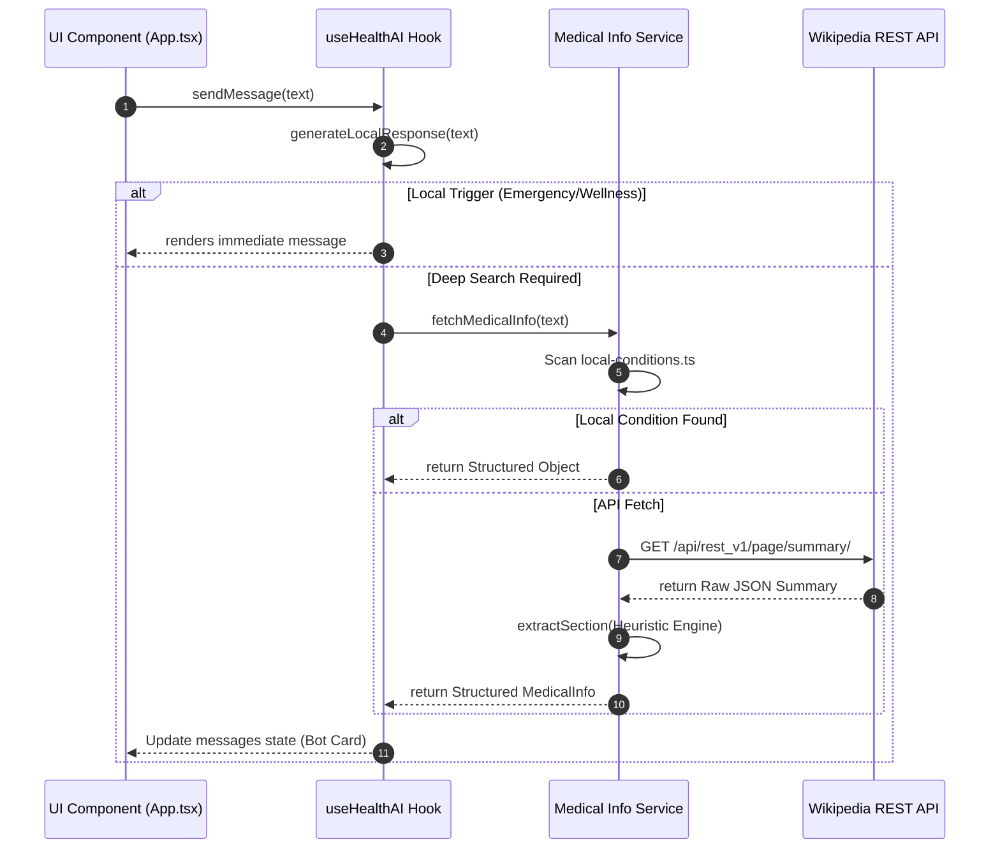

# 🏥 Wellness AI: Global Health Companion


## 📌 Project Overview
**Wellness AI** is a premium health assistant designed to bridge the gap between complex medical information and everyday accessibility. Built with **React 19**, **TypeScript**, and **Framer Motion**, it provides a sleek, glassmorphic interface for instant triage, wellness advice, and global health knowledge.

The project prioritizes **Privacy-First Intelligence**:
- **Offline-Ready Logic**: Core wellness and emergency data are handled locally.
- **Instant Triage**: Automatically scans for high-risk symptoms before any other processing.
- **Heuristic Knowledge Extraction**: A custom string-matching engine that transforms unstructured data into clinical cards.

---

## 🛑 Problem Statement
1.  **Health Anxiety**: Generic search results often present worst-case scenarios for minor symptoms, causing unnecessary panic.
2.  **Safety Delays**: During medical emergencies, users often waste time sifting through irrelevant articles instead of receiving immediate life-saving instructions.
3.  **Data Privacy**: Many AI tools send sensitive health queries to external servers, creating privacy risks for users.

## ✅ Proposed Solution
Wellness AI acts as an **Instant Intelligence Layer**:
-   **Local Triage Engine**: Detects life-threatening keywords immediately and provides instant first-aid instructions.
-   **Structured Medical Cards**: Parsers unstructured Wikipedia data and local disease logs into clear, actionable segments (Symptoms, Precautions, Medications, Remedies).
-   **Calm UI/UX**: Uses glassmorphism and smooth animations to reduce user stress during health-related interactions.

---

## 📊 System Logic & Architecture

### 1. Message Processing Flowchart
This flowchart captures the exact logic implemented in `useHealthAI.ts` and `medicalInfoService.ts`:

```mermaid
graph TD
    User([User Message]) --> LocalCheck{Local Response Engine}
    
    LocalCheck -->|Match "All Disease"| Directory[Show Disease Directory Card]
    LocalCheck -->|Match Emergency Keyword| Emergency[Show 🚨 Emergency Protocol]
    LocalCheck -->|Match Wellness Keyword| Tip[Retrieve specific 🧘 Wellness Tip]
    LocalCheck -->|Match Greeting| Hi[Friendly Greeting]
    
    LocalCheck -->|No Initial Match| MedSearch{Find Medical Info}
    
    MedSearch -->|Check Local Conditions| LocalResult[Render 🏥 Local Clinical Card]
    MedSearch -->|No Local Match| WikiAPI[Fetch Wikipedia Summary]
    
    WikiAPI -->|Success| Heuristic[Run 🧠 Heuristic Extraction Engine]
    Heuristic --> ClinicalCard[Render 🧬 Dynamic Clinical Card]
    
    WikiAPI -->|Fail| Default[Generic AI Response]
    
    Directory --> End([Display in UI])
    Emergency --> End
    Tip --> End
    Hi --> End
    LocalResult --> End
    ClinicalCard --> End
    Default --> End
```

### 2. Data Propagation Diagram
How data flows through the application's core functions:



---

## 🧪 Research Work & Reference

### Methodology
1.  **NLP Heuristics**: Instead of heavy LLMs, we developed a fast, pattern-based extraction algorithm (`extractSection`) that scans text for keyword density to identify symptoms, precautions, and treatments.
2.  **UX for Health**: Research-backed "Thinking Delay" (0.8s) simulated to provide a natural, reassuring feel while ensuring data privacy (100% Client-side).
3.  **Triage Verification**: Emergency keywords (Chest pain, Stroke, Seizure) were selected based on standard triage protocols to trigger the `EMERGENCY_MESSAGE`.

### References
-   **Wikipedia REST API**: Source for the Global Knowledge Base.
-   **Standard Triage Protocols**: Informing the Emergency Keyword List.
-   **WHO Guidelines**: Used for curating `LOCAL_CONDITIONS` (e.g., Malaria, Typhoid).

---

## 🎥 Demo & Prototype
-   **Live Repository**: [Wellness AI GitHub](https://github.com/Uman67890/ai-health-chatbox2)
-   **Video Walkthrough**: [Watch Demo Video](https://github.com/Uman67890/ai-health-chatbox2/assets)

---

## ⚖️ Disclaimer
*Wellness AI is a tool for information and educational purposes only. It does not provide medical diagnoses. Always call local emergency services in case of a medical crisis.*

---

  Built with ❤️ for Global Well-being 
